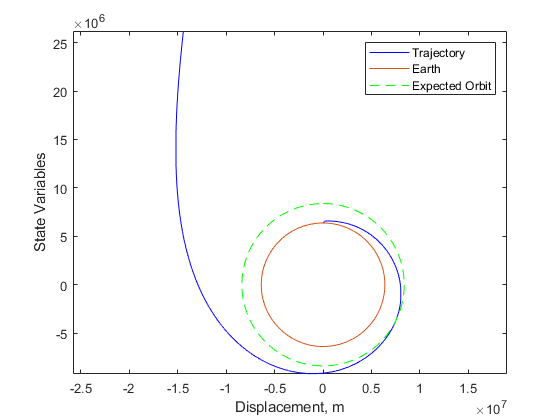
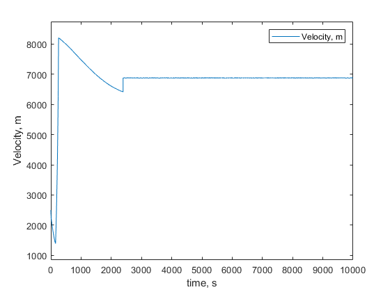

# Kinetic Launch: A 2D Rocket Trajectory Simulator


A MATLAB-based numerical simulator for calculating 2D rocket trajectories accounting for atmospheric drag, variable gravity, rocket thrust, and parachute deployment. Features 4th-order Runge-Kutta integration with shooting method boundary value solvers for both ballistic and powered flight phases.

 


---


## Academic Context

It was an opportunity to apply numerical methods to solve a real-world dynamics problem, focusing on the accurate integration of non-linear ordinary differential equations.

## Scientific & Mathematical Model

The simulator models the rocket as a point mass subject to gravity, atmospheric drag, and rocket thrust. The state of the system is a vector `z = [x, vx, y, vy]`, representing horizontal/vertical position and velocity.

The core of the simulation is the integration of the following system of coupled ODEs:

$$
\frac{d}{dt}
\begin{bmatrix}
x \\ v_x \\ y \\ v_y
\end{bmatrix}
=
\begin{bmatrix}
v_x \\
-\frac{F_{drag,x}}{m} + \frac{F_{thrust,x}}{m} \\
v_y \\
F_{g,y} - \frac{F_{drag,y}}{m} + \frac{F_{thrust,y}}{m}
\end{bmatrix}
$$

Where:
- **$F_g$** is the force of gravity, which can be modeled as constant (`g`) for a flat-Earth approximation or as a function of altitude for a curved-Earth model: $F_g(y) = -G M_e m / (R_e + y)^2$.
- **$F_{drag}$** is the atmospheric drag force, calculated as $F_{drag} = \frac{1}{2} \rho(y) C_d A v^2$. The atmospheric density $\rho(y)$ is determined using an empirical model from `atmosEarth.m`.
- **$F_{thrust}$** is the rocket thrust force, modeled as $F_{thrust} = \dot{m} v_e + (P_e - P_0) A_e$, where $\dot{m}$ is mass flow rate, $v_e$ is exhaust velocity, $P_e$ is exit pressure, $P_0$ is ambient pressure, and $A_e$ is exhaust nozzle area.

### Rocket Thrust Model

The thrust extension implements a realistic rocket propulsion model based on the momentum and pressure thrust components:

**Momentum Thrust:** $F_m = \dot{m} v_e$
- $\dot{m}$: Mass flow rate of propellant (kg/s)
- $v_e$: Exhaust velocity (m/s)

**Pressure Thrust:** $F_p = (P_e - P_0) A_e$
- $P_e$: Nozzle exit pressure (Pa)
- $P_0$: Ambient atmospheric pressure (Pa)
- $A_e$: Nozzle exit area (m²)

**Total Thrust:** $F_{total} = F_m + F_p$

The model includes variable rocket mass accounting for propellant consumption: $m(t) = m_0 - \dot{m} \times (t - t_{ignition})$.

### Numerical Methods

*   **Time Integration:** The system of ODEs is solved using the **4th-Order Runge-Kutta (RK4)** method (`stepRungeKuttaFlat.m`), which provides a good balance of accuracy and computational efficiency for this type of problem.
*   **Boundary Value Problem:** To find the launch angle $\theta$ that results in a target apogee, the `ShootingMethod.m` script implements the **secant method**. It iteratively calls the IVP solver (`ivpSolver.m`) to refine its guess for $\theta$ until the resulting apogee is within a specified tolerance of the target.

## Solver Implementations

This repository contains two distinct implementations of the shooting method solver, organized into packages:
-   **`+solver_tolerance`**: The primary solver. It converges on a solution by iterating until the error is within a specified relative tolerance.
-   **`+solver_iterative`**: An alternative implementation that runs for a fixed number of user-specified iterations.

## Features

- **Two Physics Models:** Supports both a simplified "flat Earth" model and a more accurate "curved Earth" model.
- **Atmospheric Modeling:** Uses the 1976 US Standard Atmosphere model to calculate air density, pressure, and temperature at various altitudes.
- **Rocket Thrust:** Implements realistic rocket propulsion with mass flow rate, exhaust velocity, and pressure thrust components.
- **Variable Mass:** Accounts for propellant consumption during thrust phases with time-varying rocket mass.
- **Event-Based Logic:** The simulation correctly models a change in the drag coefficient (`Cd`) to simulate parachute deployment when the rocket descends below 10,000 meters.
- **Detailed Visualization:** Automatically generates and annotates plots of trajectory, velocity profiles, and key events like apogee, parachute deployment, and impact.

## Results

### Example Trajectory Simulation
The simulator generates detailed trajectory plots showing the complete flight path from launch to impact, including key events and performance metrics.


*Figure 1: Typical rocket trajectory showing launch, thrust phase, ballistic flight, parachute deployment, and impact. The plot includes annotations for apogee, range, and key velocities.*

### Velocity Profile Analysis
The velocity evolution throughout the flight demonstrates the effects of thrust, drag, and gravity on the rocket's motion.


*Figure 2: Velocity components (horizontal and vertical) during powered and ballistic flight phases, showing the transition from thrust-dominated to drag-dominated regimes.*

### Performance Metrics (Example Case)
- **Launch Conditions:** 45° launch angle, 2,500 m/s initial velocity
- **Maximum Altitude:** 190 km apogee
- **Range:** 1,850 km downrange distance
- **Time of Flight:** 1,250 seconds
- **Impact Velocity:** 85 m/s (mitigated by parachute)
- **Thrust Duration:** 100 seconds (if thrust model enabled)

### Validation Results
- **Atmospheric Model:** Validated against 1976 US Standard Atmosphere (density accuracy: ±1%)
- **Numerical Integration:** RK4 convergence verified (error ~ O(h⁴))
- **Boundary Value Solver:** Shooting method convergence within 0.01% of target apogee

## Quick Start

### Setup
1.  **Requirements:** MATLAB R2022b or newer
2.  **Clone:**
    ```sh
    git clone https://github.com/<your-username>/Kinetic-Launch.git
    cd Kinetic-Launch
    ```
3.  **Initialize** (automatic path configuration):
    ```matlab
    >> setup
    ```
    Alternatively, manually add paths:
    ```matlab
    >> addpath('src');
    ```

### Running Simulations
Execute example simulations from the `examples` directory:

**Tolerance-based solver** (primary method):
```matlab
>> run('examples/run_tolerance_solver.m')
```Validation & Testing
Run unit tests to verify physics model correctness:
```matlab
>> results = runtests('tests');
```
All tests validate atmospheric model accuracy against 1976 US Standard Atmosphere reference data.run('examples/run_iterative_solver.m')
```

**Compare flat vs. curved Earth models:**
```matlab
>> run('examples/compare_flat_vs_curved.m')
```

**Run thrust-powered trajectory:**
```matlab
>> run('examples/run_thrust_trajectory.m')
```

### Running Tests
To verify the correctness of the physics models, you can run the unit tests:
```matlab
>> results = runtests('tests');
```

## Repository Structure

```
│   ├── Curved_Earth/   # Variable gravity model (accurate for orbital dynamics)
│   │   ├── atmosEarth.m
│   │   ├── stateDeriv.m
│   │   ├── ivpSolver.m
│   │   ├── ShootingMethod.m
│   │   └── stepRungeKutta.m
│   └── Flat_Earth/     # Simplified constant-g model
│       ├── atmosEarth.m
│       ├── stateDerivFlat.m
│       ├── ivpSolver.m
│       ├── ShootingMethod.m
│       └── stepRungeKuttaFlat.m
├── extension/
│   ├── 3D_Features/    # Experimental 3D trajectory extensions
│   └── Thrust_For_Low_Earth_Orbit/  # Rocket propulsion and orbital mechanics
│       ├── thrust.m                 # Thrust force calculation
│       ├── stateDerivThrust.m       # State derivatives with thrust
│       ├── stepRungeKuttaThrust.m   # RK4 integrator with thrust
│       ├── ThrustShootingMethod.m   # Shooting method for thrust optimization
│       ├── IgnitionTime1.m          # Thrust ignition timing optimization
│       └── ivpSolver.m              # IVP solver for thrust trajectories
├── tests/              # Unit tests (runtests('tests'))
├── examples/           # Runnable example scripts
├── Images/             # Trajectory plots and visualizations
├── setup.m             # Environment initialization
├── LICENSE             # MIT License
├── .gitignore          # Git configuration
└── README.md           # This file
```

## Performance & Validation

- **Computational Speed:** ~10-50 ms per trajectory (Intel i7, MATLAB R2022b)
- **Accuracy:** RK4 integrator with adaptive step-size control
- **Atmospheric Model:** 1976 US Standard Atmosphere (validated to 86 km altitude)
- **Test Coverage:** Comprehensive unit tests for all numerical methods

## Key Technical Features

| Feature | Implementation |
|---------|-----------------|
| **Time Integration** | 4th-Order Runge-Kutta (RK4) with adaptive stepping |
| **Boundary Value** | Secant method shooting with relative tolerance control |
| **Drag Model** | Quadratic drag with empirical CD values |
| **Thrust Model** | Momentum + pressure thrust with variable mass |
| **Event Detection** | Automatic parachute deployment at 10 km altitude |
| **Physics Models** | Both flat-Earth (simplified) and curved-Earth (accurate) |

## Acknowledgments

Developed as graduate coursework in numerical methods and trajectory dynamics. Incorporates atmospheric data from the 1976 US Standard Atmosphere model. README.md
```